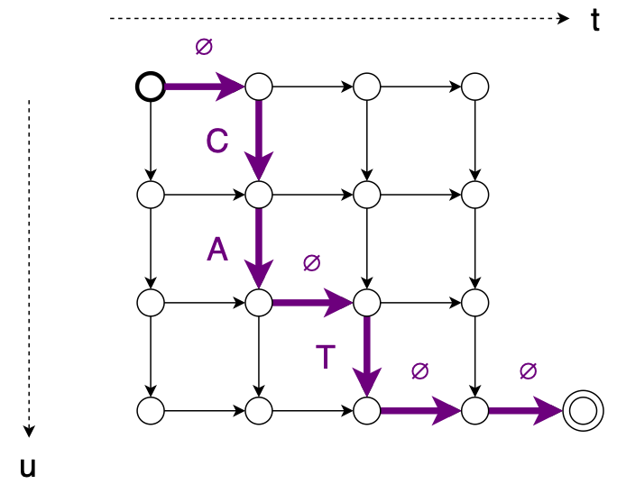

# [Transformer Transducer](https://arxiv.org/abs/2002.02562)
## Environment
OS: Ubuntu 18.04.6 LTS     
python: 3.8.13      
pytorch: torch==1.10.1+cu111      
      
      
## Abstract
- 논문은 기존 RNN-T기반의 모델에서 나아가 두개의 Transformer encoder로 이루어진 end-to-end 기반 실시간 음성 인식 모델을 제안한다.     
- encoder는 label-encoder와 audio-encoder로 나뉘며, 두 encoder에서 나온 값을 joint-network의 FFN에 넣은 뒤 softmax를 적용시켜 해당 음성 구간의 음소 확률들의 RNN-T loss를 출력한다.    
- 단 음성이 transformer의 max_length를 넘기 때문에 차원을 줄이고자 mel-filter-bank, sliding-window를 적용해 512차원으로 음성을 축소시킨다.   
     
## Transformer Transducer
     
     
크게 Label-Encoder, Audio-Encoder, Joint-Network로 구성되어 있다.    
이 때 Label-Encoder는 언어 모델의 역할을 하고 Audio-Encoder는 음향 모델의 역할을 수핸한다.    
     
Label-Encoder와 Audio-Encoder는 일반 Transformer-Encoder와 똑같지만 joint-Network는 Feed-Forward-Network다.    
FFN을 통과한 값은 곳 음성 프레임 내에 존재할 법한 label 위치에 대한 확률적 분포를 표현할 수 있다.
     
    
Transformer-Encoder는 max_length가 512이기 때문에 음성의 길이가 아무리 짧아도 Transforemr-Encoder에 넣을 수 없다.     
그렇기 때문에 음성 정보를 압축하기 위해 1차로 mel-fileter-bank를 거친 뒤 2차로 sliding-window을 진행해 값을 어떻게든 512차원 내의 값으로 압축한다.    
이 때의 음성은 sliding-window을 진행했기 때문에 각 음성은 압축되어 여러 정보가 한 프레임에 담져겨 있다 볼 수 있다.
     

## RNN-T loss
    
**C**onnectionist **T**emporal **C**lassification loss와 원리는 비슷하나 CTC loss의 단점을 보완한다.    
CTC loss의 단점은 크게 두가지로 
1. 문장을 출력할 떄 문맥을 고려하지 못한다.(음성의 일정 구간에 있는 음소를 "**예측**"만 하지, 앞 뒤 음소의 상관관계를 따지지 않는 문제)    
2. 입력 음성의 길이가 출력되는 값 보다 길어야지 정상적으로 예측이 가능하다.    
같은 문제가 존재하는데 RNN-T의 경우 2 번째 문제에서 자유롭다.     
     
CTC와 RNN-T loss는 각각 다음 등장확률에 대한 조건부 확률 계산으로 처리되는 점은 동일하나,   
다음 등장을 찾아나가는 path를 탐색하는 방법만 차이가 존재한다.  
가장 큰 차이는 CTC는 수평, 대각선 아래 이동이 가능하다는 점이나, RNN-T loss는 수직 혹은 수평으로만 움직일 수 있다.  
때문에, RNN-T는 최악의 경우 현재시점의 등장가능한 모든 vocab의 확률을 일일히 따져볼 수 있으므로, CTC loss에서의 Length 제약에서 자유로워지는 것이다.  
반대로, CTC는 무조건 대각선 이동으로, 강제로 시점이 하나씩 이동하니, Input의 길이가 충분히 길어야, 전체 output을 가늠해볼 수 있다.  
          
관련 블로그     
> [구글도 주목하는 음성인식 기술 : E2E 음성인식 기술](https://blog.naver.com/PostView.naver?blogId=nuguai&logNo=222425372642&parentCategoryNo=&categoryNo=9&viewDate=&isShowPopularPosts=true&from=search)
     
    

## pytorch
> pip install torch==1.10.1+cu111 -f https://download.pytorch.org/whl/torch_stable.html    
